# Refactoring terraform into modules

When a resource is moved to an internal/external module the terraform statefile will
need updating. If you don't do this, terraform will create and destroy
the resource(s) you've moved.

Why would terraform destroy something just to recreate an identical instance of it?
Terraform associates every resource with a name. If that name changes it is treated
as a new, not known, resource.

Let's take a look at the terraform state for this project before any module exists.

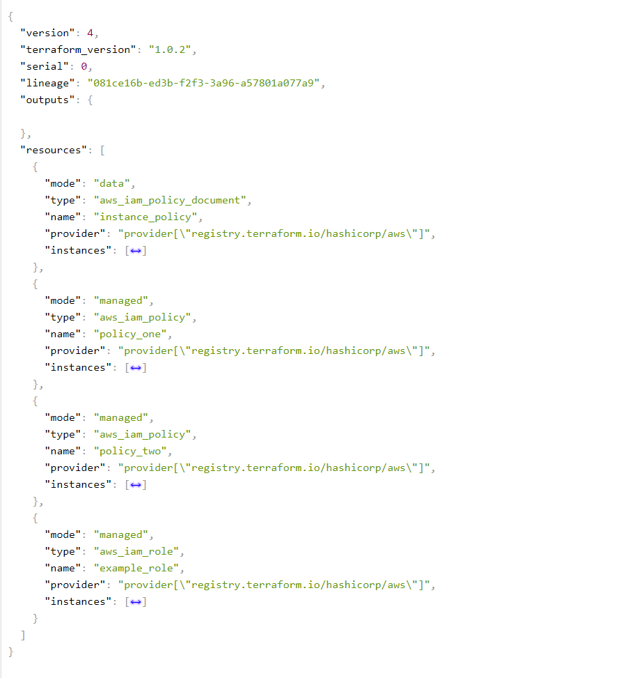

Now when we go to refactor the iam roles into a module we see this in our terminal.

Note: run a terraform init first to initialize your new module-iam module.

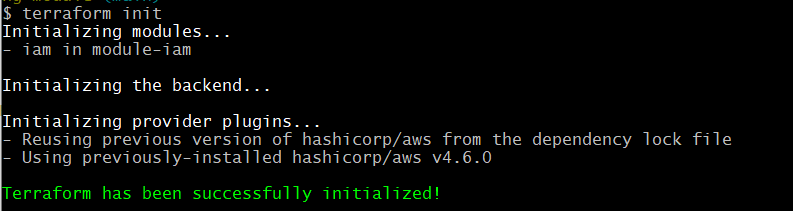

The iam roles and policies still exist in my AWS account. However, terraform doesn't know
we've just moved the code into a module. Therefore, 3 resources will be added, 3 will be
destroyed.

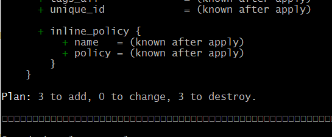

In the plan output I can see the following destruction:

- aws_iam_role.example_role
- aws_iam_policy.policy_two
- aws_iam_policy.policy_one

And additions:

- module.iam.aws_iam_role.example_role
- module.iam.aws_iam_policy.policy_two
- module.iam.aws_iam_policy.policy_one

The reason the new resources are named with a `module.iam.` prefix is because I
called the module like so:

```terraform
module "iam" {
    source = "./module-iam"
}
```

Notice how the terraform resource name `iam` is being used, not the module
directory name `module-iam`.

## How can we fix this?

1. The easiest way if you don't care about downtime or potential errors, is to run
`terraform apply` and let terraform destroy the old and create the new. Sometimes
destruction isn't instant for things like S3 buckets and CloudFront distributions, but
if you don't care that's okay.

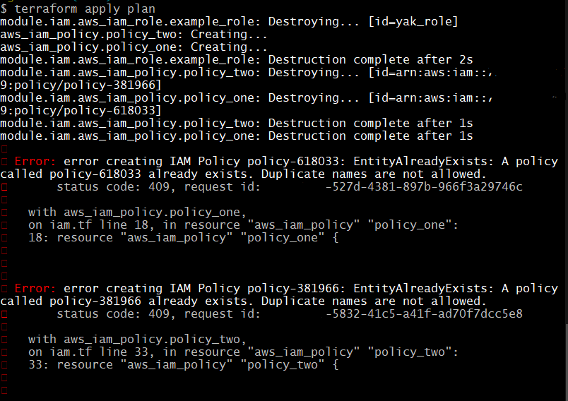

Notice how the create + destroy runs in any random order? In order to do this successfully
I need to plan + apply twice due to the conflict. You could be fancy and run a `terraform
destroy -target` first but I won't cover that in detail here.

---

2. Use the built in `terraform state mv` command. This is great for a small number of
resources but can be very labour intensive if you need to rename 100 resources.

`terraform state mv aws_iam_policy.policy_one module.iam.aws_iam_policy.policy_one`

Rinse and repeat 1 by 1 for every resource. The only way
to do this in bulk would be to write a custom script.

---

3. Moved Blocks:

Note: requires terraform `v1.1` and later otherwise you'll see this an error similar to
this (yours might say unsupported resource type as I hacked mine into a resource in order
to get this screenshot):

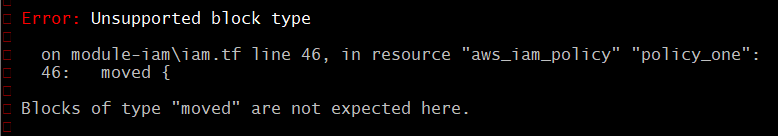

You can temporarily add a moved block in your terraform code. This is easier to move
multiple resources and will only take one plan + apply. Overall though, the effort is
likely similar to `terraform state mv`

Cool, how do I use terraform moved blocks?

First: Copy paste resources from `iam.tf` into `module-iam/iam.tf`.

Second: Add three moved blocks into `iam.tf` and run `terraform plan -out plan`

Third: You should see output like this

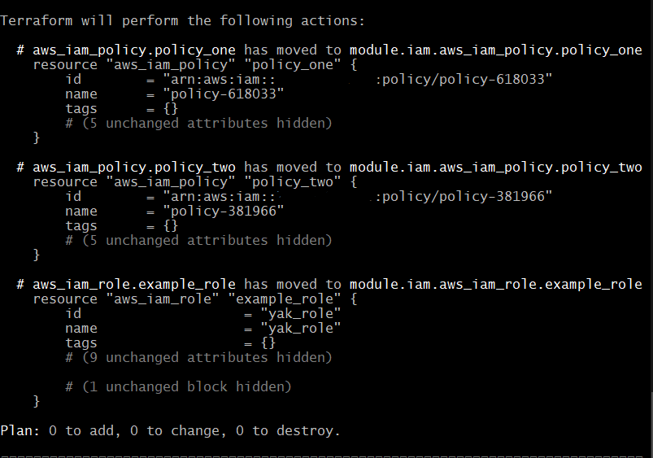

Notice how there's no create/destroy so you'll experience zero downtime or mess.

After applying run `terraform state list` to confirm your results:

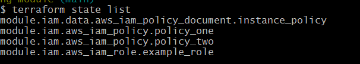

Now delete the `moved` blocks from your code (this is the tidy up step).

---

4. Not recommended for the feint hearted...

Edit the statefile directory using your code editor of choice. You can download remote
state locally, open it up in your code editor and start renaming resources manually.
Once completed, you can sync the new local state up with your remote backend.

First, change your backend to local:

```terraform
terraform {
  backend "local" {
    # bucket = "tf-state-production"
    # key    = "renaming-module"
    # region = "ap-southeast-2"
  }
}
```

Run `terraform init -migrate-state`

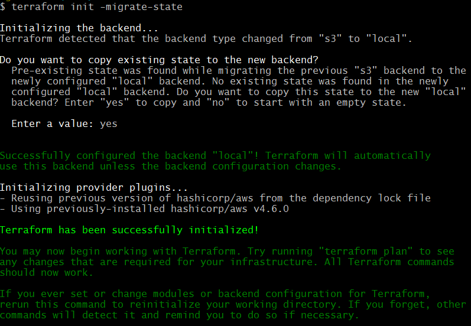

Open the newly downloaded `terraform.tfstate` file in your code editor. This should be in
the root directory near `main.tf` and NOT the file in your `.terraform/` directory.

Open the statefile and make the required changes. Here is a screenshot prior to any changes being made (3 to add and 3 to destroy since my resources have been moved to module-iam):

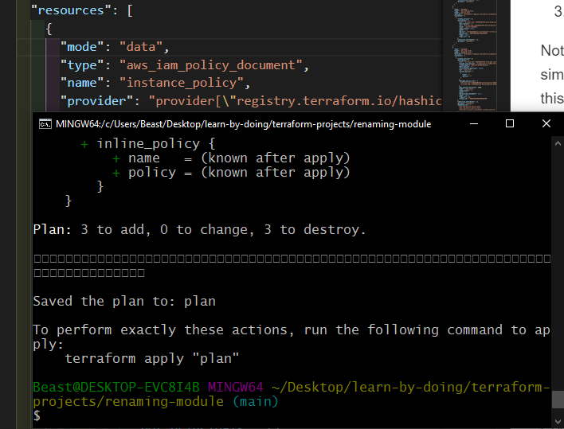

and after appending module manually in tfstate file:

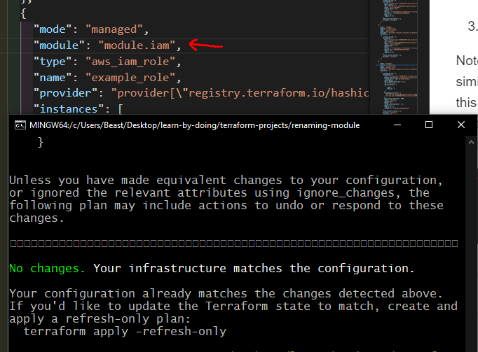

Now we change the backend back to s3 and run
`terraform init -migrate-state` since we want to upload
our edited statefile to s3 (our remote backend).

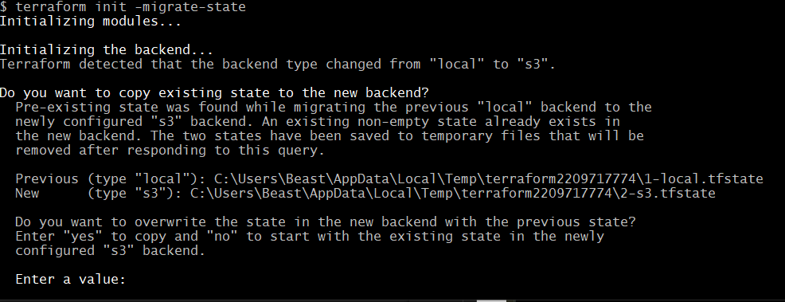

## What do all of these methods have in common?

Every method will manipulate state. Arguably using the moved blocks is the safest method as
the new code will be ideally reviewed and in source control. Plus you'll have no downtime
and terraform will rename stuff on your behalf.

The next safest is using the `terraform state mv` command as the cli interface will be
interacting with state based off what you've called it with. This command is instant and edits state directly.

Following that, terraform apply (assuming you don't mind downtime.) If downtime doesn't
matter just apply in the first instance instead of wasting time running commands or adding
more code in `moved` blocks.

Lastly the most dangerous, editing the state file manually in your code editor. There's
much more room for human error although I have seen this done many times in
the workplace before.
